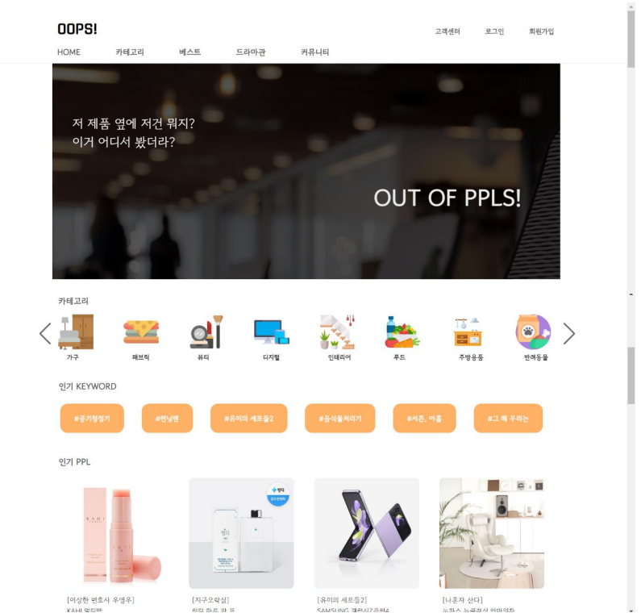
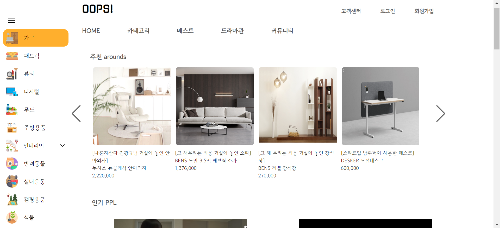
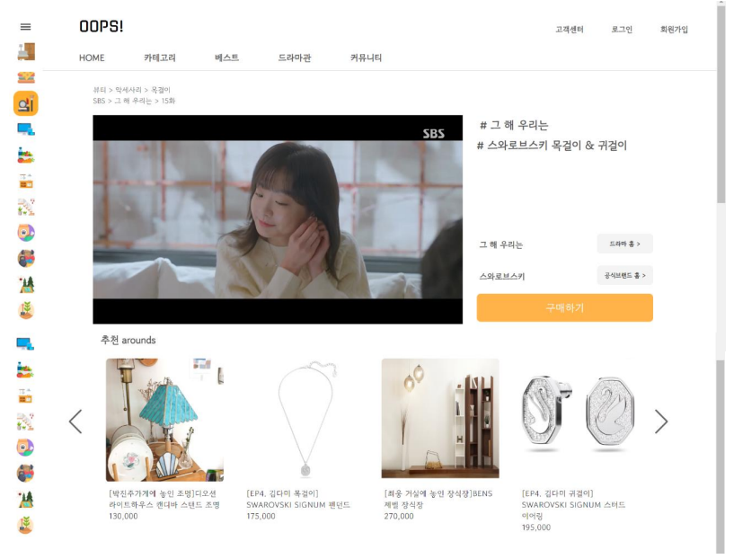
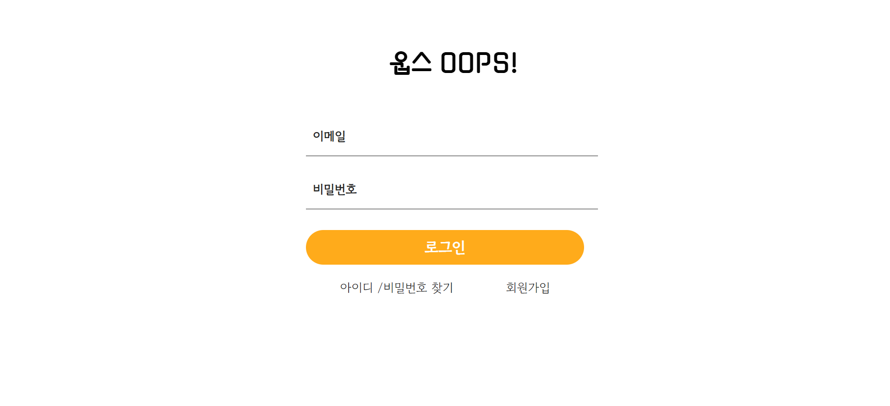
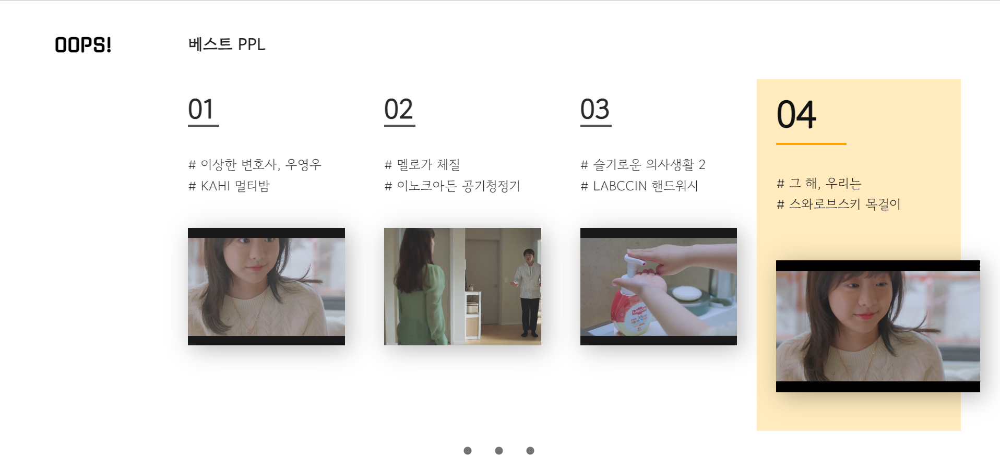
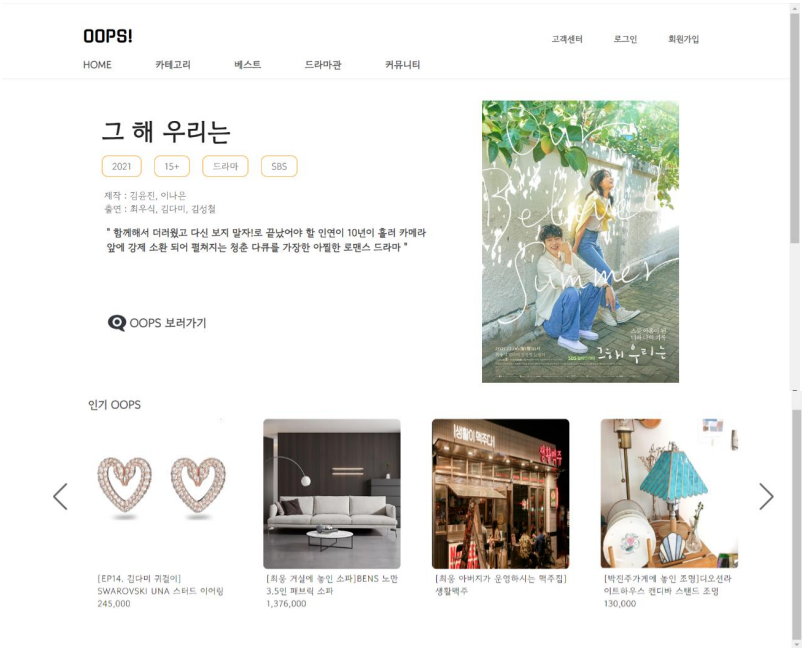
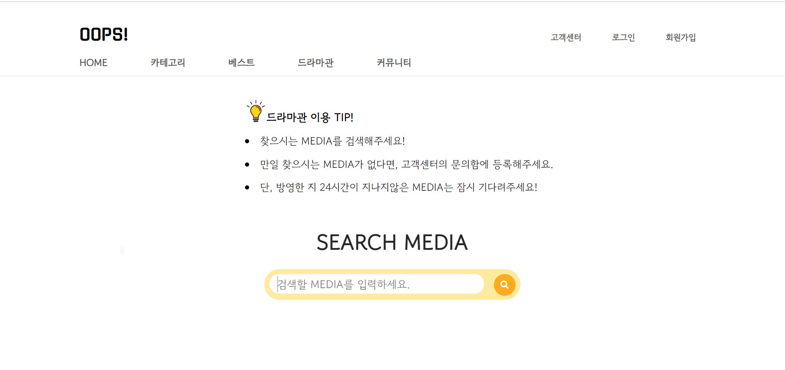
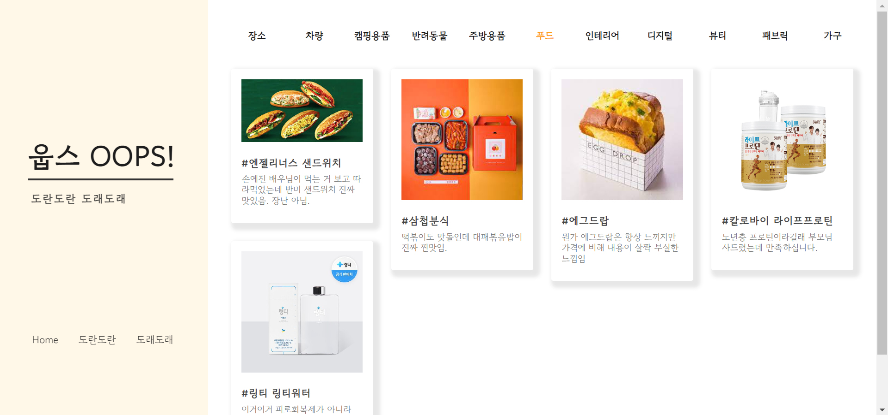

## OOPS (OUT OF PPLS)

   
  
   

### OOPS 소개

  본 웹 애플리케이션 서비스의 시스템 기능은 영상 콘텐츠의 PPL제품들을 보여주는 것뿐만 아니라 여러 기능들을 첨가하였다.  
 영상 콘텐츠의 한 장면에서 눈에 띄는 PPL 제품 이외에도 그 주변을 이루고 있는 특정장소, 배우들의 옷과 액세서리, 공간의 인테리어 제품들도 사실상 대부분이 협찬 제품이다. 간접광고를하고 있는 제품들이 아닌 그 주변을 이루고 있는 제품들에 더 눈이 가고, 구매를 희망하는 사람들을 위해 PPL을 하고 있는 제품 주변의 상품들도 보여줄 수 있게 하였다.   
  또한, 웹 애플리케이션의 유저들에게 인기가 있는 PPL 제품을 보여주는 기능, 추천하는 PPL제품을 랜덤적으로 유저들에게 보여주는 기능, 사용해본 PPL제품의 후기를 남기고 공유할 수 있는 기능, 유저가 원하는 영상 콘텐츠를 검색할 수 있는 기능, 유저들이 관심있어하는 PPL제품을 구매하는 기능까지 추가적으로 구현하였다.

 

### 기술 스택

      

 

### 구현 기능

#### MAIN

   
  
   

 

#### CATEGORY

   
  
  
   

 

#### LOGIN & SIGN UP

   
  
  
   

 

#### BEST PPL

   
  
  
   

 

#### 드라마관

   
  
   

 

#### COMMUNITY

   
  
   

 

### 배운 점 & 아쉬운 점

 향후, Docker 를 기반으로 추천 상품 알고리즘(recommender system)을 도입하여 유저에게 개인별 맞춤 상품을 제공하는 기능을 추가하고자한다. ‘셀던’나 프리딕션 IO’과 같이 추천 알고리즘을 위한 머신러닝 오픈소스 플랫폼을 이용하여 유저들이 좋아하고, 관심있어할만한 PPL 제품들을 보여주는 기능을 추가적으로 구현할 예정이다

 

### 라이센스

MIT &copy; [Ko](mailto:rhwltjs00@naver.com)
